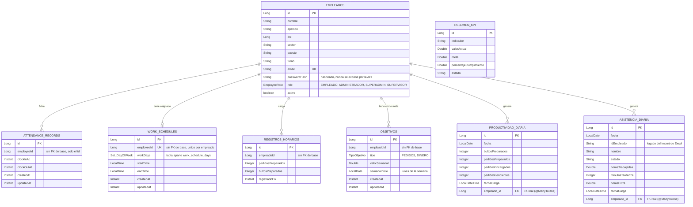

# Diagrama de Entidad-Relación — Dashboard RRHH

Este diagrama usa sintaxis [Mermaid](https://mermaid.js.org/syntax/entityRelationshipDiagram.html)
(`erDiagram`). Se renderiza automáticamente en GitHub y en VS Code (extensión "Markdown Preview
Mermaid Support" u otra equivalente).

`RESUMEN_KPI` queda fuera del diagrama de relaciones: es una tabla independiente (indicadores
globales cargados desde Excel), sin vínculo a `EMPLEADOS` ni a ninguna otra entidad.

## Notas sobre las relaciones

Todas las relaciones de `EMPLEADOS` hacia los módulos nuevos (`ATTENDANCE_RECORDS`,
`WORK_SCHEDULES`, `REGISTROS_HORARIOS`, `OBJETIVOS`) están modeladas **sin clave foránea real en
la base** — cada una guarda solo el `Long employeeId`/`empleadoId`, sin `@ManyToOne`/`@JoinColumn`
hacia `Empleados`. Es una decisión de diseño ya tomada en esos módulos (documentada en el propio
código): evita acoplar el esquema de cada módulo al de Empleados y no exige una consulta a otro
agregado para validar el dato. La contrapartida es que la integridad referencial (que ese
`employeeId` exista de verdad) no la garantiza la base de datos, sino el código de la aplicación.

En cambio, `PRODUCTIVIDAD_DIARIA` y `ASISTENCIA_DIARIA` — ambas preexistentes al login/roles,
parte del flujo de migración desde Excel — sí tienen una relación JPA real (`@ManyToOne` con
`@JoinColumn(empleado_id)`), con la restricción `FOREIGN KEY` correspondiente en la base.

## Cardinalidades

| Relación | Cardinalidad | Motivo |
|---|---|---|
| Empleados → AttendanceRecord | 1 a N | Un empleado puede tener muchos fichajes (uno por cada entrada/salida). |
| Empleados → WorkSchedule | 1 a 0..1 | Un empleado tiene, a lo sumo, un horario vigente a la vez (`employeeId` único). |
| Empleados → RegistroHorario | 1 a N | Un empleado carga muchos registros horarios (uno por hora, como máximo). |
| Empleados → Objetivo | 1 a N | Un empleado puede tener varios objetivos (distintos tipos y/o semanas). |
| Empleados → ProductividadDiaria | 1 a N | Un empleado tiene un registro de productividad por día. |
| Empleados → AsistenciaDiaria | 1 a N | Un empleado tiene un resumen de asistencia por día (importado de Excel). |
