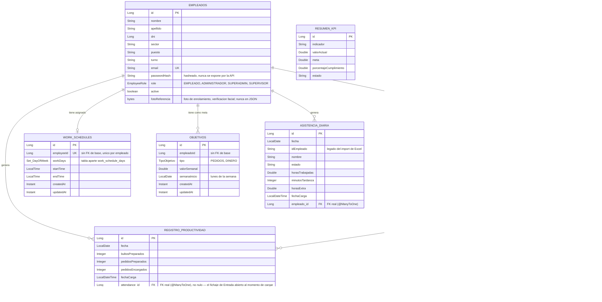

# Diagrama de Entidad-Relación — Dashboard RRHH

Este diagrama usa sintaxis [Mermaid](https://mermaid.js.org/syntax/entityRelationshipDiagram.html)
(`erDiagram`). Se renderiza automáticamente en GitHub y en VS Code (extensión "Markdown Preview
Mermaid Support" u otra equivalente).

`RESUMEN_KPI` queda fuera del diagrama de relaciones: es una tabla independiente (indicadores
globales cargados desde Excel), sin vínculo a `EMPLEADOS` ni a ninguna otra entidad.

## Notas sobre las relaciones

Las relaciones de `EMPLEADOS` hacia `WORK_SCHEDULES` y `OBJETIVOS` están modeladas **sin clave
foránea real en la base** — cada una guarda solo el `Long employeeId`/`empleadoId`, sin
`@ManyToOne`/`@JoinColumn` hacia `Empleados`. Es una decisión de diseño ya tomada en esos módulos
(documentada en el propio código): evita acoplar el esquema de cada módulo al de Empleados y no
exige una consulta a otro agregado para validar el dato. La contrapartida es que la integridad
referencial (que ese `employeeId` exista de verdad) no la garantiza la base de datos, sino el
código de la aplicación.

En cambio, `REGISTRO_PRODUCTIVIDAD` y `ASISTENCIA_DIARIA` sí tienen una relación JPA real
(`@ManyToOne` con `@JoinColumn(empleado_id)`), con la restricción `FOREIGN KEY` correspondiente en
la base. `REGISTRO_PRODUCTIVIDAD` además tiene una segunda FK real, no nula, hacia
`ATTENDANCE_RECORDS` (`attendance_id`): cada carga de productividad queda atada al fichaje de
Entrada que estaba abierto en ese momento — el servicio lo resuelve solo (busca la Entrada sin
Salida del empleado autenticado); si no hay ninguna abierta, la carga falla con 409.

## Verificación facial (Empleados ⇄ AttendanceRecord)

`Empleados.fotoReferencia` (cargada al dar de alta) y `AttendanceRecord.fotoCapturada` (tomada en
cada clock-in) son las dos fotos que se comparan. La comparación en sí **no vive en esta base de
datos**: la hace un microservicio Python aparte (`face-recognition-service/`), al que el backend
le manda ambas fotos y recibe de vuelta una similitud — solo el resultado (`similitudFacial`,
`estadoVerificacion`) queda persistido acá.

## Cardinalidades

| Relación | Cardinalidad | Motivo |
|---|---|---|
| Empleados → AttendanceRecord | 1 a N | Un empleado puede tener muchos fichajes (uno por cada entrada/salida). |
| Empleados → WorkSchedule | 1 a 0..1 | Un empleado tiene, a lo sumo, un horario vigente a la vez (`employeeId` único). |
| Empleados → Objetivo | 1 a N | Un empleado puede tener varios objetivos (distintos tipos y/o semanas). |
| Empleados → RegistroProductividad | 1 a N | Un empleado carga varios registros de productividad (uno por día, típicamente). |
| AttendanceRecord → RegistroProductividad | 1 a N | Un fichaje de Entrada puede respaldar varias cargas de productividad hechas mientras estuvo abierto. |
| Empleados → AsistenciaDiaria | 1 a N | Un empleado tiene un resumen de asistencia por día (importado de Excel). |
